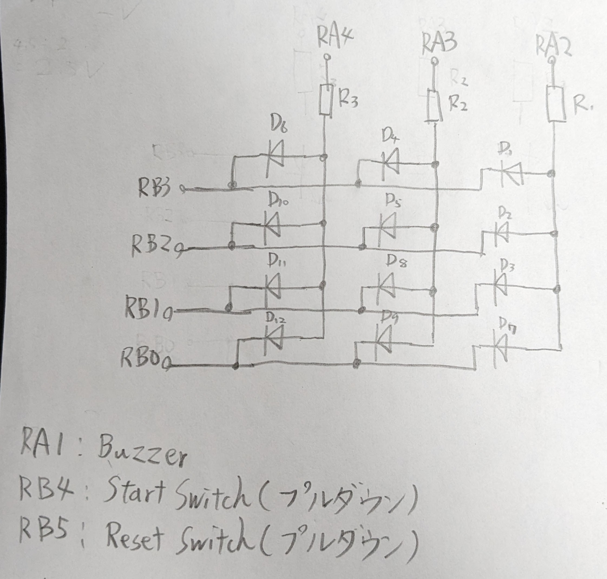

回路図  


ステート  


# MPLAB setup
MPLABは5.35以下じゃないとアセンブリがデフォルトで入っていないので注意

ここから5.35 linuxをinstall
https://www.microchip.com/en-us/tools-resources/archives/mplab-ecosystem

```
tar -xvf MPLABX-v5.35-linux-installer.tar
```

Ubuntu(Debian)の場合、以下のコマンドを入力
ref:https://developerhelp.microchip.com/xwiki/bin/view/software-tools/ides/x/archive/linux/
```
sudo dpkg --add-architecture i386
sudo apt update
sudo apt-get install libc6:i386 libx11-6:i386 libxext6:i386 libstdc++6:i386 libexpat1:i386
```

```
sudo ./MPLABX-v5.35-linux-installer.sh
```

# License
MIT License
